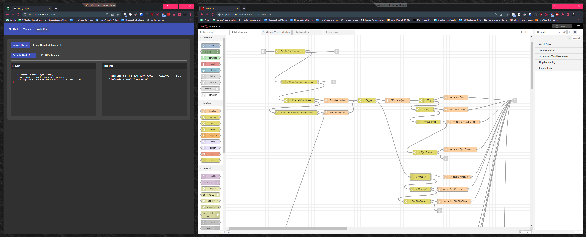
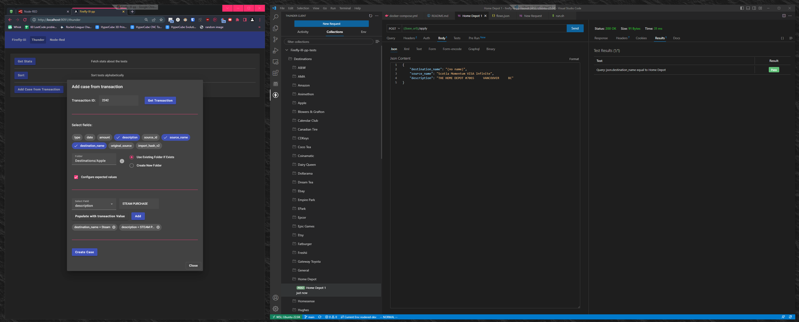
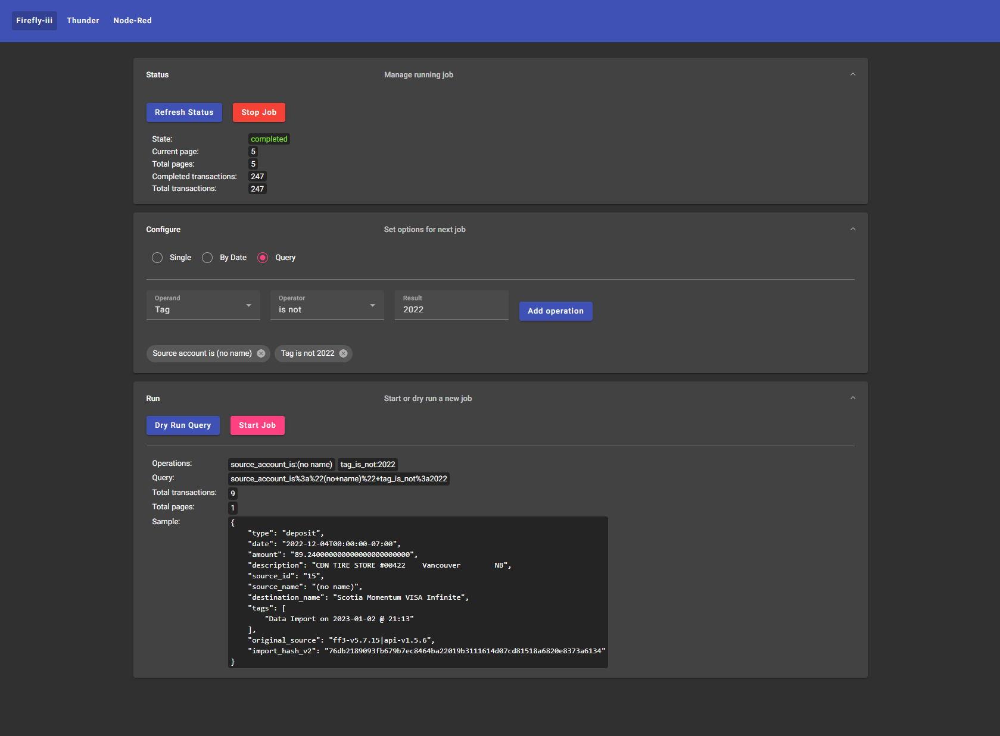

# Firefly-iii-pp

[](https://github.com/haondt/firefly-iii-pp/releases/latest)
[](https://hub.docker.com/r/haumea/fireflyiii-pp)

A set of companion tools for post-processing transactions in Firefly-iii.

## About

I love [Firefly-iii](https://github.com/firefly-iii/firefly-iii), but the only problem is it has a very weak rule system. You can apply changes to transactions by filtering through a set of rules, but the operators are limited to `is`, `is not`, `greater than` and `less than`. Furthermore, you can only join a list of conditions with an `and` or an `or`. For my purposes I needed at least nested conditions and regular expressions.

This project provides an interface to create rules in [Node-Red](https://nodered.org/), which not only satisfies my requirements, but allows even more complexity such as loops and external tools.



With such complex rules, it's easy to make a breaking change and permanently ruin your transactions. So, I've added a framework built around [Thunder Client](https://www.thunderclient.com/) for regression testing of rules. This includes a tool to automatically build a test case from an existing Firefly-iii transaction and send it to Thunder Client.



Once the rules are created and regression tested, this project also includes a tool for running the rules on a set of transactions. The transactions to run on can be filtered by transaction ID, by a time period, or by a query formed by a set of conditions. The query filtering leverages Firefly-iii's [search](https://docs.firefly-iii.org/firefly-iii/pages-and-features/search/) feature, and can be dry run to test the query before starting the rule-running process.




## Deployment

### Deploy via Docker Hub
- Add [Thunder Client](https://marketplace.visualstudio.com/items?itemName=rangav.vscode-thunder-client) VS Code extension
  - [Enable Git Sync -> Save To Workspace](https://github.com/rangav/thunder-client-support#git-sync)
- Create a docker compose file using the contents of `docker-compose.prod.yml`
- Ensure your directory has the following structure
    ```
    .
    ├── docker-compose.yml
    ├── flows.json
    ├── flows_cred.json
    └── thunder-tests
        ├── thunderActivity.json
        ├── thunderCollection.json
        ├── thunderEnvironment.json
        └── thunderclient.json
    ```
- Run
    ```shell
    docker compose up -d
    ```
- Navigate to Node-Red at `http://localhost:1880/`
- Navigate to Firefly-iii-pp at `http://localhost:9091/`

### Build locally and deploy
- Run
    ```shell
    docker compose -f docker-compose.build.yml up -d
    ```

### Build for Development

#### Startup
- Ensure docker desktop running
- Start nodered
    - Run node red with docker compose
        ```shell
        docker compose up -f docker-compose.dev.yml -d
        ```
    - open up nodered (`http://localhost:1880/`) and import flows from `flows.json`.
- Start api
    - Open up `Firefly-iii-pp-Runner` in Visual studio
    - Start `Firefly-iii-pp-Runner.API` with `Docker` launch settings. It will create a docker container. Check in docker desktop to see which port it is assigned.
- Start UI
    - Check `pp-frontend/pp-frontend/src/environments/environment.ts` to make sure the api url matches that of the api, port included.
    - Run the app. Me personally I have better luck doing this in powershell than wsl
        ```shell
        cd pp-frontend/pp-frontend
        npm install
        ng serve
        ```
    - Navigate to `http://localhost:4200/`
- Open thunder client
    - Open environment `firefly-pp-dev` and verify `base_url` is pointing at the correct port for the api

#### Build and deploy to docker hub
- Run
    ```shell
    ./docker-builder.sh [tag]
    ```

## Notes
- Importing flows to Node-Red should be done with the Node-Red UI
- Exporting flows from Node-Red can be done through the pp frontend